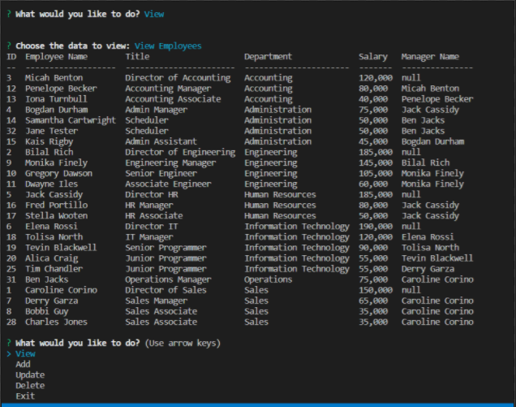
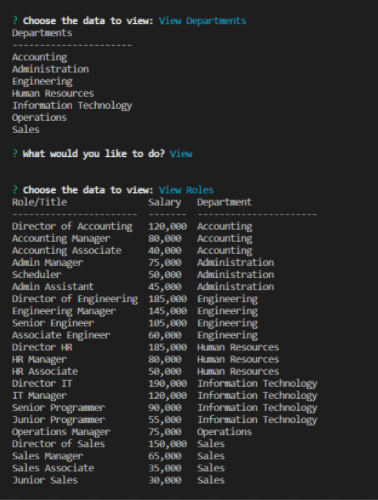

# Employee Tracker
## 
## Description 
Employee Tracker offers a command line, menu driven tracking system. Users are able to add, update, delete, and view departments, roles, and employees. Uers can view employees by manager and total budget utilization by department. All data is stored in a mySQL database.
## Table of Contents
- [Installation](#installation)
- [Usage](#usage)
- [Screenshot](#screenshot)
- [Screencast](#screencast)
- [License_Details](#license_details)
- [Contributing](#contributing) 
- [Tests](#tests)
- [Questions](#questions)
## Installation
To install the necessary dependencies run:

npm i

The database schema can be created by running schema.sql. Seed data is available in seed.sql.
The application depends on the following applications and libraries: mySQL, npm inquirer, 
npm console.tables.

## Usage

To use install dependencies by entering "npm i" on the command line. To run the application 
enter "node index.js" or "npm start" on the command line. Follow the menus to add, update, 
delete, and view data.

## Screenshot

## Screencast
[Screencast Link](https://drive.google.com/file/d/1dkzVJnCZVMxSaWaTrFlhoRBWk_J0H3Dz/view?usp=sharing)
## License_Details

This project is licensed through: MIT

## Contributing

Programmed by Coleen Stuhlfire

## Tests

To test, install npm i, create the database schema from schema.sql, enter seed data from seed.sql. 
Run the application and follow the menus to assess functionality.

## Questions

If you have questions about the repo, open an issue or contact me at 
cstuhlfire@gmail.com. 

You can find this project along with my other work
at: [github](https://github.com/cstuhlfire).

